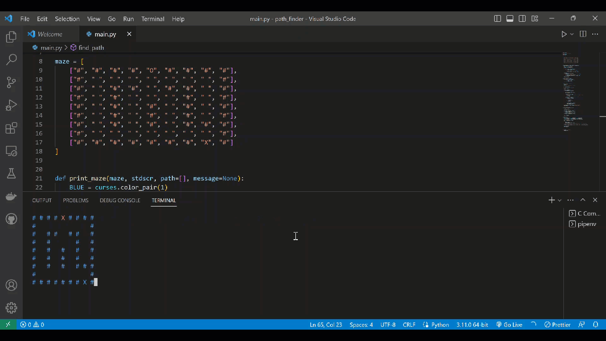

# Breadth First Search Algorithm

> This is a simple implementation of the Breadth First Search Algorithm in Python.




## Usage

#
1: Install the dependencies:

```bash
pipenv install -r requirements.txt 
```

#
2: Run server:

```bash
python main.py
```

## License
MIT © iAlex0
